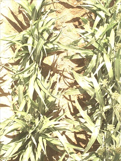

# Transformer Soil Mask

Converts an RGB image into a soil mask in which the soil is represented as black.

The core idea for this Transformer is a plant-soil segmentation. 

## Algorithm Description

The core idea for this Transformer is a plant-soil segmentation. We apply a threshold to differentiate plant and soil, and do a smoothing after binary processing. Saturated portions of the image are removed. At the end, it returns the plant area ratio (canopy cover) within a bounding box.

Steps:

1. Split image data into R,G,B channel, and make a tmp image.
2. For each pixel, if G value is T(threshold) higher than R value, make this pixel as foreground, and set the tmp pixel value to 255, so all tmp pixels are 0 or 255.
3. Use a filter to blur this tmp image
4. Remove anomalies (small areas incorrectly classified as plant of interest)
4. Threshold the blurred tmp image with a threshold of 128 to get a new mask image that represents our plant (foreground) detections.
5. Remove saturated pixels
5. Output ratio = foreground pixel count / total pixel count

### Parameters

* G - R Threshold is set to 2 for normal situation.
* Blur: image to new mask threshold is set to 128; passed to the OpenCV blur function.
* Saturation threshold: threshold for classifying a pixel as saturated. Default is 245 in a greyscale imagess
* Small Area Threshold: Used to remove anomalies from the image - this parameter is the size of a mask fragment in pixels that is removed. 

### Quality Statement

Currently, this algorithm has been used on wheat and sorghum; it has been tested on lettuce but only works when the leaves are green (fails if they are red or purple).

We believe the tested threshold works well in a normal illumination. Below are three examples of successful segmentation:


At the same time, there are some limitations with the current threshold. Here are some examples:

1. Image captured in a low illumination.


2. Image captured in a very high illumination.



3. In late season, panicle is covering a lot in the image, and leaves is getting yellow.


4. Sometimes an unidentified sensor problem results in a blank image.


For more details, see related discussions, including: https://github.com/terraref/reference-data/issues/186#issuecomment-333631648

### Sample Docker Command line

Below is a sample command line that shows how the soil mask Docker image could be run.
An explanation of the command line options used follows.
Be sure to read up on the [docker run](https://docs.docker.com/engine/reference/run/) command line for more information.

```docker run --rm --mount "src=/home/test,target=/mnt,type=bind" agpipeline/soilmask:2.0 --working_space "/mnt" --metadata "/mnt/08f445ef-b8f9-421a-acf1-8b8c206c1bb8_metadata_cleaned.json" "/mnt/08f445ef-b8f9-421a-acf1-8b8c206c1bb8_left.tif" ```

This example command line assumes the source files are located in the `/home/test` folder of the local machine.
The name of the image to run is `agpipeline/soilmask:2.0`.

We are using the same folder for the source files and the output files.
By using multiple `--mount` options, the source and output files can be separated.

**Docker commands** \
Everything between 'docker' and the name of the image are docker commands.

- `run` indicates we want to run an image
- `--rm` automatically delete the image instance after it's run
- `--mount "src=/home/test,target=/mnt,type=bind"` mounts the `/home/test` folder to the `/mnt` folder of the running image

We mount the `/home/test` folder to the running image to make files available to the software in the image.

**Image's commands** \
The command line parameters after the image name are passed to the software inside the image.
Note that the paths provided are relative to the running image (see the --mount option specified above).

- `--working_space "/mnt"` specifies the folder to use as a workspace
- `--metadata "/mnt/08f445ef-b8f9-421a-acf1-8b8c206c1bb8_metadata.cleaned.json"` is the name of the source metadata to be cleaned
- `"/mnt/08f445ef-b8f9-421a-acf1-8b8c206c1bb8_left.tif"` is the name of the image to mask

## Acceptance Testing

There are automated test suites that are run via [GitHub Actions](https://docs.github.com/en/actions).
In this section we provide details on these tests so that they can be run locally as well.

These tests are run when a [Pull Request](https://docs.github.com/en/github/collaborating-with-issues-and-pull-requests/about-pull-requests) or [push](https://docs.github.com/en/github/using-git/pushing-commits-to-a-remote-repository) occurs on the `develop` or `master` branches.
There may be other instances when these tests are automatically run, but these are considered the mandatory events and branches.

### PyLint and PyTest

These tests are run against any Python scripts that are in the repository.

[PyLint](https://www.pylint.org/) is used to both check that Python code conforms to the recommended coding style, and checks for syntax errors.
The default behavior of PyLint is modified by the `pylint.rc` file in the [Organization-info](https://github.com/AgPipeline/Organization-info) repository.
Please also refer to our [Coding Standards](https://github.com/AgPipeline/Organization-info#python) for information on how we use [pylint](https://www.pylint.org/).

The following command can be used to fetch the `pylint.rc` file:
```bash
wget https://raw.githubusercontent.com/AgPipeline/Organization-info/master/pylint.rc
```

Assuming the `pylint.rc` file is in the current folder, the following command can be used against the `soilmask.py` file:
```bash
# Assumes Python3.7+ is default Python version
python -m pylint --rcfile ./pylint.rc soilmask.py
``` 

In the `tests` folder there are testing scripts; their supporting files are in the `test_data` folder.
The tests are designed to be run with [Pytest](https://docs.pytest.org/en/stable/).
When running the tests, the root of the repository is expected to be the starting directory.

These tests use some of the files downloaded from [CyVerse](https://de.cyverse.org/dl/d/3C8A23C0-F77A-4598-ADC4-874EB265F9B0/scif_test_data.tar.gz).
The following commands download and extracts the files in this archive:
```bash
curl -X GET https://de.cyverse.org/dl/d/3C8A23C0-F77A-4598-ADC4-874EB265F9B0/scif_test_data.tar.gz -o test_data/scif_test_data.tar.gz
tar -xzvf test_data/scif_test_data.tar.gz -C test_data/
```

The command line for running the tests is as follows:
```bash
# Assumes Python3.7+ is default Python version
python -m pytest -rpP
```

If [pytest-cov](https://pytest-cov.readthedocs.io/en/latest/) is installed, it can be used to generate a code coverage report as part of running PyTest.
The code coverage report shows how much of the code has been tested; it doesn't indicate **how well** that code has been tested.
The modified PyTest command line including coverage is:
```bash
# Assumes Python3.7+ is default Python version
python -m pytest --cov=. -rpP 
```

### Docker Testing

The Docker testing Workflow replicate the examples in this document to ensure they continue to work.
