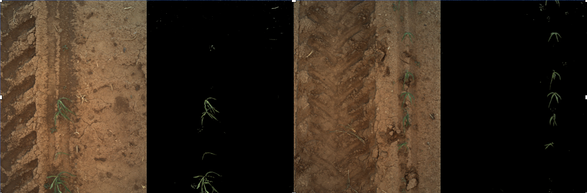

# Transformer Soil Mask

Converts an RGB image into a soil mask in which the soil is represented as black.

The core idea for this Transformer is a plant-soil segmentation. 

## Algorithm Description

The core idea for this Transformer is a plant-soil segmentation. We apply a threshold to differentiate plant and soil, and do a smoothing after binary processing. Saturated portions of the image are removed. At the end, it returns the plant area ratio (canopy cover) within a bounding box.

Steps:

1. Split image data into R,G,B channel, and make a tmp image.
2. For each pixel, if G value is T(threshold) higher than R value, make this pixel as foreground, and set the tmp pixel value to 255, so all tmp pixels are 0 or 255.
3. Use a filter to blur this tmp image
4. Remove anomalies (small areas incorrectly classified as plant of interest)
4. Threshold the blurred tmp image with a threshold of 128 to get a new mask image that represents our plant (foreground) detections.
5. Remove saturated pixels
5. Output ratio = foreground pixel count / total pixel count

### Parameters

* G - R Threshold is set to 2 for normal situation.
* Blur: image to new mask threshold is set to 128; passed to the OpenCV blur function.
* Saturation threshold: threshold for classifying a pixel as saturated. Default is 245 in a greyscale imagess
* Small Area Threshold: Used to remove anomalies from the image - this parameter is the size of a mask fragment in pixels that is removed. 

### Quality Statement

Currently, this algorithm has been used on wheat and sorghum; it has been tested on lettuce but only works when the leaves are green (fails if they are red or purple).

We believe the tested threshold works well in a normal illumination. Below are three examples of successful segmentation:




At the same time, there are some limitations with the current threshold. Here are some examples:

1. Image captured in a low illumination.


2. Image captured in a very high illumination.


3. In late season, panicle is covering a lot in the image, and leaves is getting yellow.


4. Sometimes an unidentified sensor problem results in a blank image.


For more details, see related discussions, including: https://github.com/terraref/reference-data/issues/186#issuecomment-333631648


### Sample Docker Command line
Below is a sample command line that shows how the soil mask Docker image could be run.
An explanation of the command line options used follows.
Be sure to read up on the [docker run](https://docs.docker.com/engine/reference/run/) command line for more information.

```docker run --rm --mount "src=/home/test,target=/mnt,type=bind" agpipeline/soilmask:2.0 --working_space "/mnt" --metadata "/mnt/08f445ef-b8f9-421a-acf1-8b8c206c1bb8_metadata_cleaned.json" "/mnt/08f445ef-b8f9-421a-acf1-8b8c206c1bb8_left.tif" ```

This example command line assumes the source files are located in the `/home/test` folder of the local machine.
The name of the image to run is `agpipeline/soilmask:2.0`.

We are using the same folder for the source files and the output files.
By using multiple `--mount` options, the source and output files can be separated.

**Docker commands** \
Everything between 'docker' and the name of the image are docker commands.

- `run` indicates we want to run an image
- `--rm` automatically delete the image instance after it's run
- `--mount "src=/home/test,target=/mnt,type=bind"` mounts the `/home/test` folder to the `/mnt` folder of the running image

We mount the `/home/test` folder to the running image to make files available to the software in the image.

**Image's commands** \
The command line parameters after the image name are passed to the software inside the image.
Note that the paths provided are relative to the running image (see the --mount option specified above).

- `--working_space "/mnt"` specifies the folder to use as a workspace
- `--metadata "/mnt/08f445ef-b8f9-421a-acf1-8b8c206c1bb8_metadata.cleaned.json"` is the name of the source metadata to be cleaned
- `"/mnt/08f445ef-b8f9-421a-acf1-8b8c206c1bb8_left.tif"` is the name of the image to mask

## Transformer class dependencies
This transformer has the following requirements from the [Environmental](https://github.com/AgPipeline/AgPipeline.github.io/blob/transformers/transformers/transformers.md) Transformer class.

Expected method signatures and explanations:
- **get_image_file_epsg(file_name: str) -> str**: function returns the EPSG code from a georeferenced image file, or None
- **default_epsg -> str**: property returning the expected EPSG; compared against a file's EPSG code to determine if the resulting mask file needs to be converted to match the default EPSG
- **get_image_file_geobounds(file_name: str) -> list**: function returns the geographic boundaries of a georeferenced image file as a list ordered as [min_y, max_y, min_x, max_x] or a list of four numpy.nan values if the file is not georeferenced
- **generate_transformer_md() -> dict**: function returns a dictionary with the following minimum set of keys:
    - `name`: the name of the transformer (the configuration.py file can be used for this)
    - `version`: the version of the transformer (the configuration.py file can be used for this)
    - `author`: the author of the transformer (the configuration.py file can be used for this)
    - `description`: the description of the transformer (the configuration.py file can be used for this)
    - `repository`: optional repository URI of transformer source code (the configuration.py file can be used for this)
    
