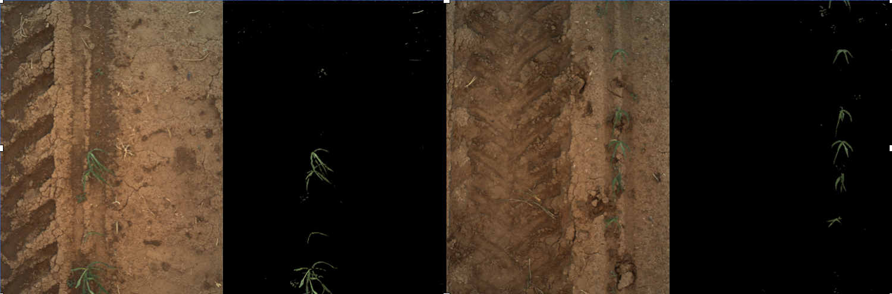
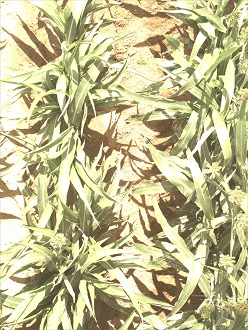

# Canopy cover extractor

Canopy Cover by Plot (Percentage of Green Pixels)

## Authors

* Zongyang Li, Donald Danforth Plant Science Center, St. Louis, MO
* Maxwell Burnette, National Supercomputing Applications, Urbana, Il
* Robert Pless, George Washington University, Washington, DC

## Overview

This extractor processes binary stereo images and generates values of plot-level percent canopy cover traits that are inserted into the BETYdb trait database.

 The core idea for this extractor is a plant-soil segmentation. 
 We apply a threshold to differentiate plant and soil, and do a smoothing after binary processing. 
 From this difference, it returns a plant area ratio within the bounding box.

_Input_

  - Evaluation is triggered whenever a file is added to a dataset
  - Following data must be found
    - _left.bin image
    - _right.bin image
    - dataset metadata for the left+right capture dataset; can be attached as Clowder metadata or included as a metadata.json file
    
_Output_

  - The configured BETYdb instance will have canopy coverage traits inserted

## Algorithm description

The core idea for this extractor is a plant-soil segmentation. We apply a threshold to differentiate plant and soil, and do a smoothing after binary processing. At last it returns a plant area ratio within the bounding box.

Steps:

1. Split image data into R,G,B channel, and make a tmp image.

2. For each pixel, if G value is T(threshold) higher than R value, make this pixel as foreground, and set the tmp pixel value to 255, so all tmp pixels are 0 or 255.

3. Use a filter to blur this tmp image,

4. Threshold the blurred tmp image with a threshold of 128 to get a new mask image that represents our plant (foreground) detections.

5. Output ratio = foreground pixel count / total pixel count

### Parameters

* G - R Threshold is set to 5 for normal situation.
* Blur image to new mask threshold is set to 128

## Implementation

### Quality Statement

We believe the tested threshold works well in a normal illumination. Below are three examples of successful segmentation:

At the same time, there are some limitations with the current threshold. Here are some examples:

1. Image captured in a low illumination.

2. Image captured in a very high illumination.

3. In late season, panicle is covering a lot in the image, and leaves is getting yellow.

4. Sometimes an unidentified sensor problem results in a blank image.

For more details, see related discussions, including: https://github.com/terraref/reference-data/issues/186#issuecomment-333631648
